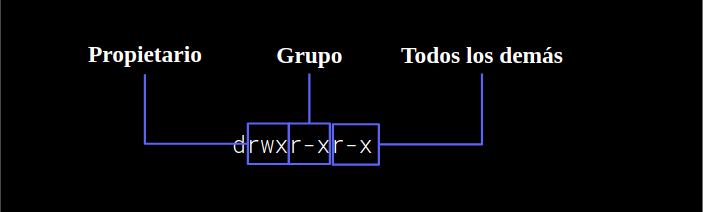

#### Ejemplo 04
## Comandos relacionados con permisos de archivos y carpetas.

### OBJETIVO
Conocer los comandos relacionados con permisos de archivos y carpetas.

#### REQUISITOS

1. Terminal.
1. Docker.

#### DESARROLLO
1. Enlista tu carpeta sesion02-Consola-vim a detalle, que hiciste dentro del Reto 3.
```
$ cd sesion02-Consola-vim
$ ls -lF
```
```
drwxr-xr-x 4 root root 4096 Jun 11 20:33 beduTravels/
drwxr-xr-x 2 root root 4096 Jun 11 20:32 ejemplos/
drwxr-xr-x 2 root root 4096 Jun 11 20:32 retos/
```
<hr>

Los permisos de las carpetas y archivos se dividen en tres partes:


Permisos:   
--- -> 0  
--x -> 1  
-w- -> 2  
-wx -> 3  
r-- -> 4  
r-x -> 5  
rw- -> 6  
rwx -> 7  

r: permiso de lectura  
w: permiso de escritura  
x: permiso de ejecución  

2. Cambiaremos el permiso de la carpeta de ejemplos donde el grupo sólo pueda leer/modificar y los usuarios externos solo puedan leer.

```
$ chmod 762 ejemplos
```
```
drwxr-xr-x 4 jose jose 4.0K may 10 12:43 beduTravels/
drwxr-xr-x 2 jose jose 4.0K may 10 12:42 ejemplos/
drwxr-xr-x 2 jose jose 4.0K may 10 12:42 retos/
                                                                  antes
--------------------------------------------------------------------------
drwxr-xr-x 4 jose jose 4.0K may 10 12:43 beduTravels/
drwxrrw--w- 2 jose jose 4.0K may 10 12:42 ejemplos/
drwxr-xr-x 2 jose jose 4.0K may 10 12:42 retos/
                                                                  después
```

