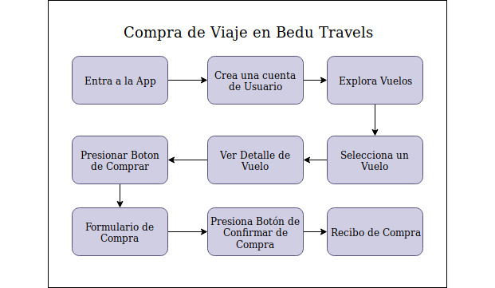

[<-- Regresar](../)

##### Ejercicio 5

## Diagrama de Flujo de Interaccion

### Objetivo 

Que el alumno aprenda a representar un Flujo de Interacción mediante un diagrama.

### Desarrollo

Tiempo estimado de explicación: **10 min**