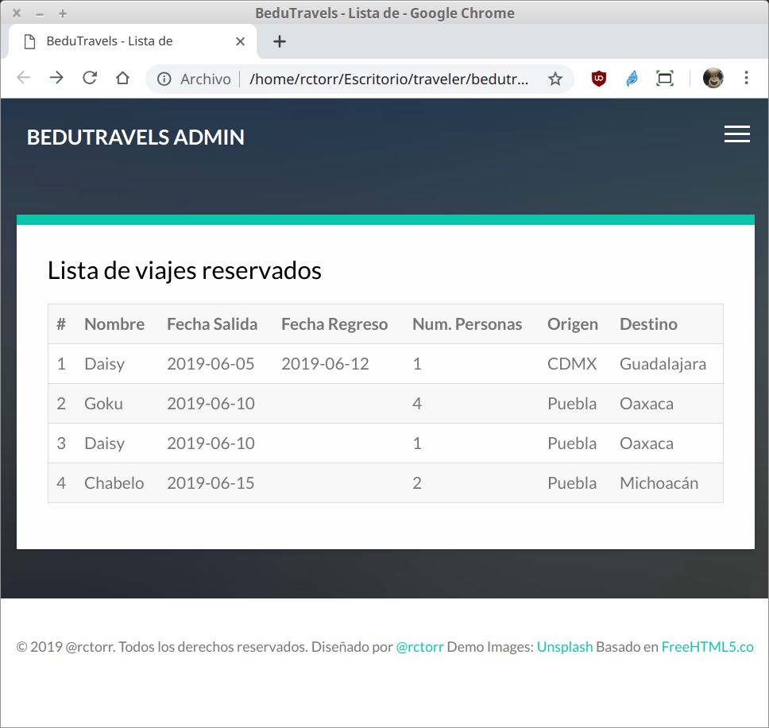
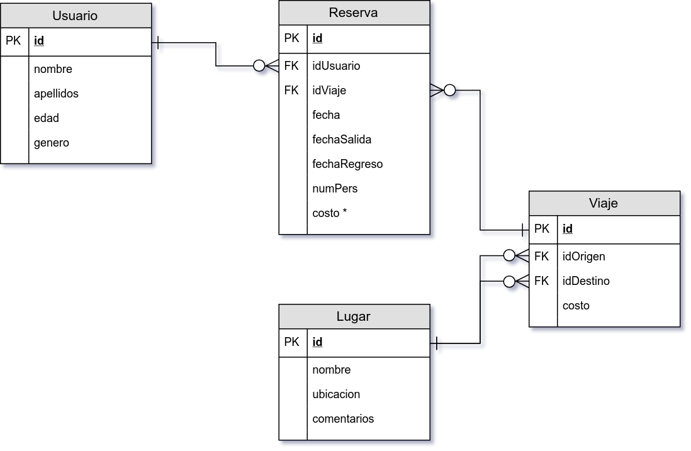
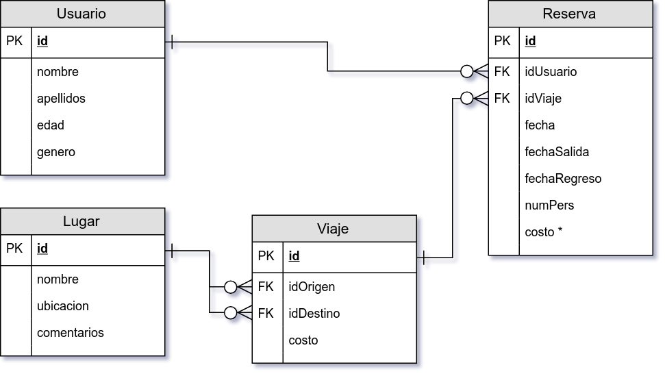

[`Backend Fundamentals`](../../Readme.md) > [`Sesión 05`](../Readme.md) > Proyecto
## Actualizando el modelo entidad-relación con nuevos requerimientos

### OBJETIVO
Dados nuevos requerimientos, actualizar el diagrama del modelo entidad-relación de la base de datos para el proyecto BeduTravels.

#### REQUISITOS
1. Descripción del proyecto:

   Un cliente requiere de una aplicación web que permita a un usuario buscar un destino para agendar un viaje.

   El usuario deberá poder ver una lista de los lugares más populares, así como poder ordenar o filtrar los destinos por costo.

   El usuario deberá poder ver la información del viaje y contar con la opción de poder elegir el viaje, así como ajustar algunas otras opciones del mismo.

1. Modelo de entidad-relación anterior:

   

1. Nuevos requerimientos.

   El Cliente requiere que la aplicación web muestre la lista de todos los viajes reservados para poderles dar seguimiento, la lista debe de incluir los datos que se muestran en la siguiente imagen:

   

   Cada Usuario puede realizar una o más reservaciones, cada reservación está relacionada con un sólo viaje y un viaje está definido por un origen, un destino y un costo.

   Para obtener el costo de una reservación, se multiplica el costo del viaje por el número de personas.

#### DESARROLLO
1. Determinar si hay nuevas tablas a incluir, se buscan sustantivos:

   __Descripcón:__

   >El Cliente requiere que la aplicación web muestre la de todos los viajes reservados para poderles dar seguimiento, la lista debe de incluir los datos que se muestran en la siguiente imagen:

   >Cada Usuario puede realizar una o más reservaciones, cada reservación está relacionada con un sólo viaje y un viaje está definido por un origen, un destino y un costo.

   >Para obtener el costo de una reservación, se multiplica el costo del viaje por el número de personas.

   Las nuevas posibles tablas son ???

   __Indicar si existen nuevas tablas y cuales son:__

   ???

1. Determinar si hay cambio en los atributos de cada una de las tablas.

   __Nota:__ Hacer uso de las siguiente información:
   - Requerimientos originales
   - Nuevos requerimientos
   - Lista de viajes reservados mostrada en la imagen

   __Indicar si existe cambios en los atributos y cuales son por cada tabla:__

   
   ***

1. Ahora toca encontrar la __cardinalidad__ entre las tablas y en caso de contar con una relación muchos a muchos romperla usando el proceso de normalización:

   
   ***

1. El paso final es más de estrategia y consiste en reacomodar el diagrama, colocando a la izquierda la tablas con cardinalidades fijas y a la derecha las tablas con cardinalidades muchos.

   
   ***
