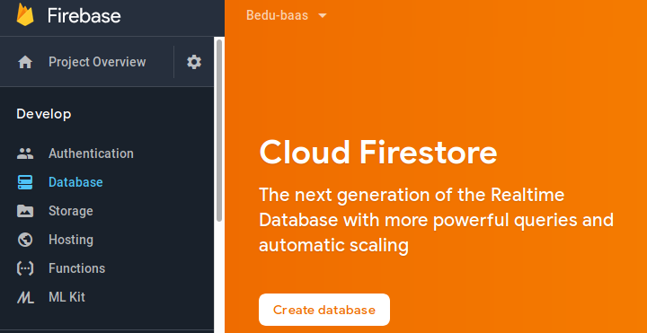
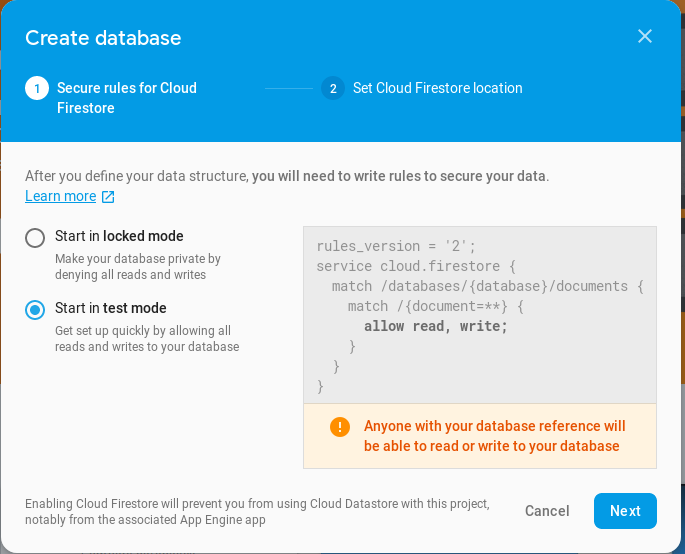

[<-- Regresar](../)

## Configurar Database de Firebase

### Objetivos 

Aprender a configurar una base de datos dentro de un proyecto de Firebase

### Requisitos 

- Explorador
- Proyecto Firebase

### Desarrollo

1. Entra a la [consola de Firebase](https://console.firebase.google.com/u/0/)
2. Selecciona el proyecto que creaste en el Ejemplo 1
3. En el menú del lado derecho, dentro de la sección `Develop` dar click en `Database`
4. En la sección que aparecerá del lado derecho, dar click en el botón `Create Dababase`

5. Asegurate de seleccionar la opción de prueba para no limitar el acceso a la base de datos en el primer paso del modal que aparecerá

6. Selecciona la opción default para la locación de tu base de datos.

Tiempo aproximado **5 min**
