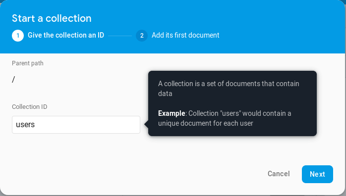
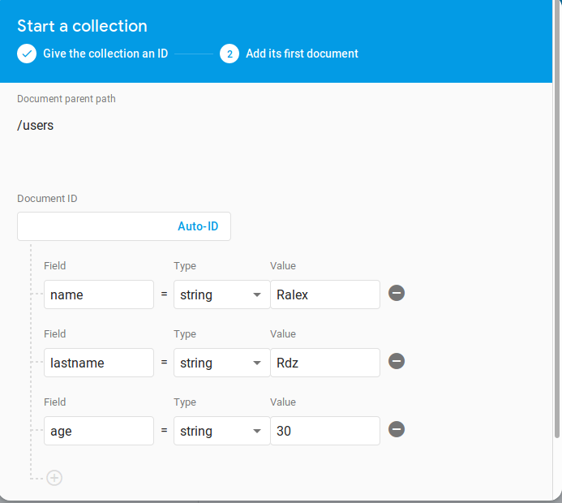

[<-- Regresar](../)

## Crea una nueva Collection y agrega primer Documento

La base de datos de Firebase es NoSQL por lo que, de la misma manera que MongoDB, estará estructurado en colecciones, que dentro tienen documentos que dentro tienen duplas de campos con valores.

### Objetivos 

- Aprender a crear colecciones para una base de datos de un proyecto Firebase
- Aprender a insertar Documentos dentro de una colección de una base de datos de un proyecto de Firebase 

### Requisitos 

- Proyecto Firebase
- Haber configurado una base de datos

### Desarrollo

1. Entrar a Database en el menú de la derecha dentro de la sección `Develop`
2. Dentro de la pestaña `Data`, dar click en el botón `+ Start collection`
3. Abrirá un modal, escribir en el nomstyle="width: 500px" />bre(id) de la colección `users`

4. Agregar los campos: `name`, `lastname`, `age` y sus valores para el primer documento 

Tiempo aproximado **5 min**